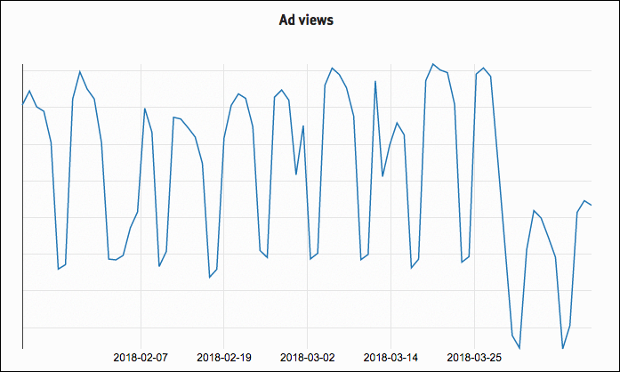

.. post:: May 2, 2018
   :tags: advertising, privacy, sustainability, business, adblock
   :author: David
   :location: SAN

Ads and Ad blockers
===================

Last time, we shared how :doc:`ethical advertising works </ethical-advertising-works>`
to keep Read the Docs sustainable without creepy ad targeting.
This time, we will share about one of our biggest challenges with advertising.
At the beginning of April, Read the Docs was added to one of the most popular
ad block lists: the `Easylist`_.

.. _EasyList: https://easylist.to/

Ad blocker fallout
------------------

Getting added to the EasyList had a significant and immediate impact
on the bottom line at Read the Docs.
Right around April 1, **32% of our ad views simply vanished**.
At first, we thought we had done something horribly wrong
but then we discovered that this was due entirely to ad blocking.
Our actual traffic wasn't down at all.

Users' browsers were simply downloading the updated EasyList
which blocked ads on Read the Docs.
In terms of ad viewership, weekdays
-- our busiest days and the peaks in the graph --
became more like weekends and weekends fell off a cliff.
We had always guessed what percentage of our user base ran ad blockers.
Now we know. We knew this day would come as we became more successful
but we had hoped it was a ways off considering we weren't part of a large ad network.

This directly affected our operations and staff.
Our operating costs didn't go down in any significant way, but revenue sure did.
Advertising is by far the largest source of revenue at Read the Docs
and it just dropped by about a third.
This meant that we had to cut some costs where we could and slow down some hiring plans.
While Read the Docs is not a non-profit company,
all the revenue is reinvested into the project itself, paying maintainers,
and other places in the open source ecosystem.
The situation is not dire by any means,
but it was certainly disappointing that we ended up on the same list
with popup advertisers who couldn't care less about privacy.

All about ad blockers
---------------------

Ad blockers fulfill a legitimate need to mitigate the
`significant downsides of advertising`_ from tracking across the internet,
security implications of third-party code,
and impacting the UX and performance of sites.

At Read the Docs, we specifically didn't want those things.
That's why we built the ad network we wanted to exist with
only relevant ads and no creepy behavioral targeting.

According to a `2017 report from PageFair`_ (pdf),
a company that specializes in quantifying ad blocking,
11% of global web users run an ad blocker.
Considering that Read the Docs' core audience is tech-savvy,
privacy-conscious developers,
it should be no surprise that our number is higher.

.. _significant downsides of advertising: https://docs.readthedocs.io/en/latest/ethical-advertising.html#ethical-info
.. _2017 report from PageFair: https://pagefair.com/downloads/2017/01/PageFair-2017-Adblock-Report.pdf

What are we doing about it
--------------------------

It will be an uphill battle to get back to where we were in terms of revenue
and sustaining Read the Docs, here are a few things we are working on:

* We applied to the `acceptable ads`_ list,
  an ad block list enabled on many ad blockers by default
  that enables some unobtrusive advertising.
  We are very hopeful here but it does take quite a bit longer
  to get on this list than it does to get blocked.
* Nagging users into allowing ads on Read the Docs.
  We are envisioning more of a polite nag in a similar vein to `jsfiddle`_
  rather than an "adblock wall" which prevents usage of Read the Docs
  until it's allowed.
* Blogging and raising awareness of how ad blocking affects us and other
  open source projects.

While we could simply change our CSS and ad API to avoid blocking
since we host our ads ourselves,  we decided not to engage in a cat and mouse game
since this work would not benefit users.

Advertising funds much of the web and many people recognize
that while there are plenty of bad actors in the ad industry
-- think pop-under ad networks or ads that navigate your browser for you --
some advertising is necessary to power the web we know and love
especially when it comes to open source software which has
`unique funding challenges`_.

**Update**: On May 4th, Read the Docs was added to the acceptable ads list!
We will collect data over the next couple weeks and have a follow-up post
on what effects this had on advertising.

.. _acceptable ads: https://acceptableads.com/
.. _jsfiddle: https://jsfiddle.net/
.. _unique funding challenges: https://www.fordfoundation.org/library/reports-and-studies/roads-and-bridges-the-unseen-labor-behind-our-digital-infrastructure/

Open source advertising list
----------------------------

At Read the Docs, we also discovered that we are not the only open source project
that got our advertising blocked by ad blockers.
Many open source projects that fund themselves
through advertising get blocked
and some of them don't have the resources to navigate the acceptable ads program
or understand the inner workings of ad blockers.

Likewise, some web users may not want to allow all acceptable ads
which includes many ads from the big networks but we are hoping they would be
willing to accept ads that benefit their community of software developers.

We are launching a **new initiative** to
`allow advertising that benefits open source software`_. We encourage
you to subscribe to the this list and support open source.
If you run an open source project affected by ad blockers, we would love to help you too.

.. _allow advertising that benefits open source software: https://ads-for-open-source.readthedocs.io

.. admonition:: Advertisers

    If you are an advertiser interested in reaching a 100% developer
    audience who cares deeply about privacy,
    we would love to `hear from you`_ too.

    .. _hear from you: https://readthedocs.org/sustainability/advertising/
