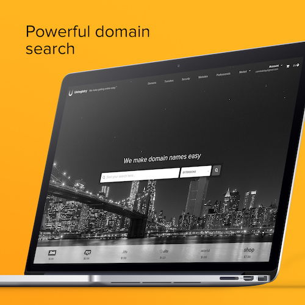
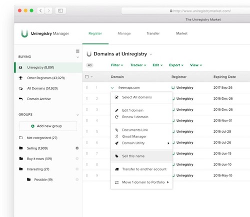

.. post:: April 3, 2017
   :tags: advertising, sustainability

Uniregistry sponsors Read the Docs and Open Source
==================================================

Today we're excited to announce an important sponsorship partner in our :doc:`Ethical Advertising <readthedocs:advertising/ethical-advertising>` campaign: `Uniregistry`_. Our goal with our ethical advertising program is to provide important funding for open source, and show that it can be done ethically -- without tracking our users and only offering ads from relevant partners. 

Domain registration was identified early as a natural partner to our program, because it sits in the stack of necessary infrastructure for all of us that work on making the internet. We wanted the right partner, because historically we feel that domain registration companies have had awful UX. We'll cover a few of the criteria we used to reach the conclusion to partner with Uniregistry.

**We've worked with Uniregistry to offer 25% off first year registrations and/or transfers for Read the Docs users**,
using the code ``DOCS25``.
`Sign up`_ now to get started.
Purchasing domain names with Uniregistry is easy and secure,
and you'll find a number of features that you won't find with other registrars:

Usability
---------

Uniregistry makes every interaction simple and minimal.
This pays off with a complete experience that should delight you.
It doesn’t suck.

Domain registration starts with search.
Their clutter-free, fast-loading search gives access to hundreds of TLDs worldwide.
They make everything you might need to do possible within one or two clicks, instead of 10.

They also have native apps on iOS and Android, and make it easy to grab a new domain, manage your existing names, or transfer in and out at your leisure.

Privacy and Security
--------------------

Uniregistry offers free WHOIS Privacy on every domain. There's no nickel-and-diming to protect your personal information. In recent years, those of you who have your phone numbers and emails on domain registration have come to experience being heckled by automated phone calls and spam. Uniregistry takes this off the table with no extra cost to you.  Uniregistry’s competitors charge between $3.99 and $7.99 for what should be your right, not a paid privilege.

Two step verification is built right into the product as well. They are the registrar for people who own one domain or thousands, so they had to build in security and tools to put you in complete control. Since they have handled the use case of the most demanding domain owners in the industry, you get the same benefits even if you just buy one.

Price
-----

Most domain registrars which provide good pricing are constantly up-selling and playing renewal games that cost money.  Uniregistry offer transparent, honest pricing on your most valuable assets. They have built a business like we would, they have never charged its customers for WHOIS privacy, they believe that freedom from unwelcome solicitation or online harassment is a fundamental right, not an opportunity for an upsell.

Uniregistry is hyper-focused on domain registration. They don’t offer hosting, so you are not being up-sold constantly. Their pricing across the board is competitive, while providing a first class experience. 

Additionally, we worked with Uniregistry to give you a discount for not only new domain purchases, but also your transfers. Use this link as our thank you for supporting open source through your domain registration. `Try it`_ and see if you agree.

No Lock-in
----------

Uniregistry doesn't hide things like domain transfer codes. Domain renewals are a major source of cheap profit for other hosts, but it's quite simple to switch with Uniregistry. They provide the transparency required to be a long term partner to you in managing your online presence.

The Story behind the story
--------------------------

Uniregistry was founded by Frank Schilling. They are the fastest growing registrar on the planet, driven by Frank, who is the best-known individual on the planet when it comes to domain registration. Under his direction, they have grown to be the operator of 25 new gTLDs, with more than 3.5 million domains under management.

As part of this sponsorship, Frank said, “I have a deep level of respect and love for this industry. I want nothing more than to grow a sustainable and dynamic business that empowers future generations of entrepreneurs, domain name investors, online businesses, and individual users around the world. The ultimate goal of Uniregistry is to make getting online easy. I believe we’re improving that experience each day. We are helping our customers unlock the tremendous power of their domains.” 

We're happy to partner with Uniregistry to offer you a great domain experience.

Get Started
-----------

Uniregistry is offering our users 25% off first year registrations and/or transfers into Uniregistry, using the code ``DOCS25``.
We hope that you'll enjoy getting started with the service,
and find it as useful as we do.
`Sign up`_ now to get started.

Some small print: *Terms: Offer valid from March 31, 2017 to May 31, 2017 at 23:59:59 UTC for first year registrations and/or transfers in to Uniregistry.com. Excludes select extensions: .sucks & .game. Not including premiums. For redemption, you must have or create a new account at Uniregistry.com and comply with all Uniregistry.com registration policies and terms of service. Cannot be used in conjunction with any other offer, sale, discount or promotion; not redeemable for any other service; no cash value. This offer and all Uniregistry registration services are governed by the law of Grand Cayman, our home.*

.. _Uniregistry: https://uniregistry.com/readthedocs
.. _Try it: https://uniregistry.com/readthedocs
.. _Sign up: https://uniregistry.com/readthedocs
