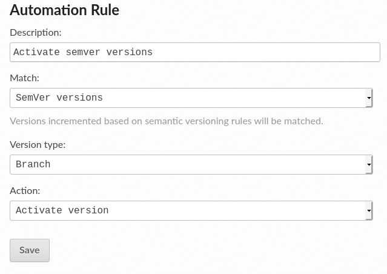

.. post:: May 4, 2020
   :tags: feature, automation-rules
   :author: Santos
   :location: CUE

Automation Rules
================

A time ago we introduced a new feature to help users to automate some tasks on Read the Docs.
:doc:`Automation rules <readthedocs:automation-rules>`.

If you manage a project with several versions,
you may have noticed that Read the Docs doesn't always activate your new versions [1]_.
If you require to do any action over a new version,
you'll need to log in your Read the Docs account and manually do so.

With automation rules,
you can choose what do to after a new version is created.
To add a rule, you only need to choose a pattern and an action.
After that, every new tag or branch that matches the pattern will trigger the action.

Currently, we only have two actions available:

- Activate version
- Set version as default

For the pattern, you can select:

- All versions
- The ones that match SemVer
- Or you can write your own using a regular expression

With automation rules you can do things like:

- Activate new tags only
- Activate only branches that start with ``v``
- Activate tags and branches that belong to the ``1.x`` release
- Set as default tags that have the ``-stable`` or ``-release`` suffix
- Activate all tags except those containing the ``--nightly`` suffix

Find more information and examples in :doc:`our documentation <readthedocs:automation-rules>`.

What other tasks you would like to automate?
Let us know on a `GitHub issue <https://github.com/readthedocs/readthedocs.org/issues/>`__!

.. [1] We activate and build new versions automatically only if you follow :pep:`440`,
       and the new version is greater than the current stable version.
