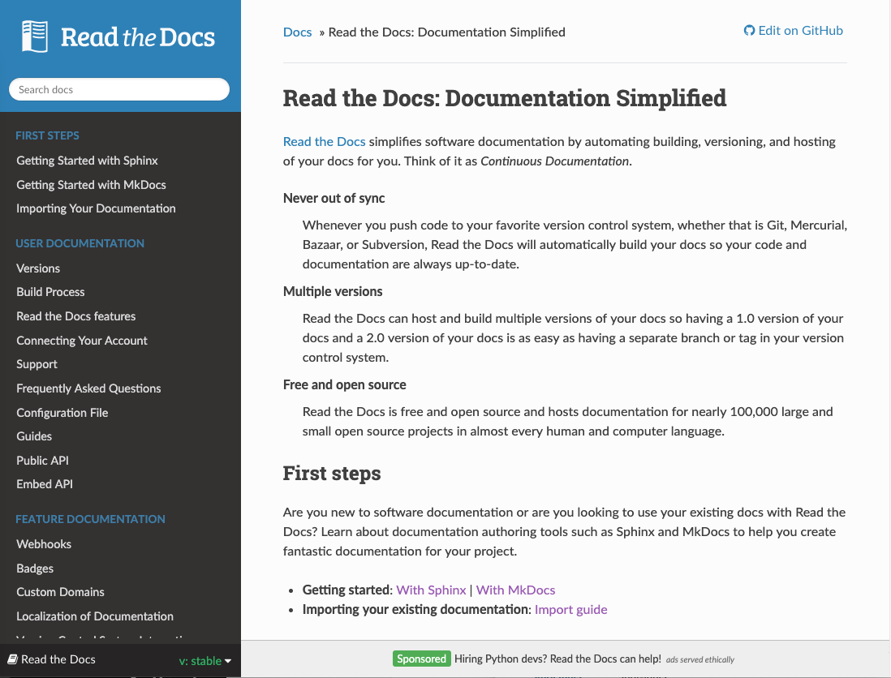

.. post:: June  18, 2019
   :tags: advertising, sustainability, business
   :author: David
   :location: SAN

New Ad Format Coming to Read the Docs Community Sites
=====================================================

We view our ad program as a way to keep Read the Docs itself sustainable,
and to use it to better support the community.
Advertising has allowed us to have full-time employees adding new features
and responding to issues in our issue tracker.
We have also been able to share thousands of dollars with the open source community
via our revenue share program and grants.

Currently, about 30% of our site traffic does not have any advertising.
When we first launched ethical advertising in 2016,
we launched only on :doc:`specific documentation themes </ads-on-other-themes>`.
We purposely did this slowly to make sure our ads look integrated
with Read the Docs and less obtrusive to users.

For a while, this wasn't a problem because we had not reached capacity with advertising.
We did not have enough paid advertisers to support the amount of pageviews Read the Docs served.
Fast forward a couple years,
and our advertising model has :doc:`proven to be successful </ad-funding-read-the-docs-whats-next>`.
In North America and Western Europe,
**100% of pages that are eligible for paid advertising have a paid ad**.

Now that we've hit that limit, it makes sense to expand to more themes.
Rather than going theme by theme as we did in the past,
especially considering the huge number of Sphinx themes,
we designed an ad that would work across all Sphinx themes.
This became much easier with a more simple text-only ad as you will see.

To be very explicit,
**this new ad format will show advertising on all documentation themes**.
We plan to roll this new ad format out more widely in stages:

* To start with, we are going to enable this ad format for community and house advertising
  on pages that already have ads on them.
  As always, we never display two ads on the same page so this ad will be instead of any other ad.
* After that, we will allow paid advertisers to use this new format.
  Again, we will start only on pages that already have ads.
* We will email users of custom documentation themes to let them know this change is coming.
* At first, we will show only community and house ads on these custom themes.
* Finally, we'll turn on our normal ad rotation to all themes.
  We expect to complete this by the end of July.

We will closely monitor feedback from document authors, readers, and advertisers during this process.
If you have questions or comments on this, please `let us know`_.

.. _let us know: mailto:ads@readthedocs.org?subject=New%20Ad%20Format%20Feedback

Text-only ads
-------------

We've wanted to try text-only ads for a while but it took time to get it right.
From the start, we were very keen on text-only advertisements
because they aren't as obtrusive as image-based ads
and they are easier for advertisers to create and experiment with multiple variations.
What we didn't know was whether users would engage with them at similar rates to our other ads.

We ran a small experiment with a text-only house ad
on the Read the Docs documentation itself and the results were very promising.
Engagement rates were over double our site average
and even compared favorably with the same ad in the sidebar including an image.
Those figures may not hold up as the format is rolled out more widely but it is certainly a good sign.

    A text-only footer advertisement on the Read the Docs documentation

I'd like to thank Eric Berry over at `CodeFund <https://codefund.io/>`_ for some great ideas
and insights around this kind of ad format.

Opting Out
----------

We understand that advertising doesn't work for everyone -- even advertising without any user tracking.

Users can opt-out of paid advertising themselves and for any projects they maintain
although they will still see community ads for open source projects and conferences.
Gold members of Read the Docs get an ad-free experience
and for companies we have our `commercial offering at readthedocs.com`_
which is always ad-free.

If you would like to completely remove advertising from your open source project,
but our commercial plans don't seem like the right fit,
please `get in touch`_ to discuss alternatives to advertising.

.. _get in touch: mailto:ads@readthedocs.org?subject=Alternatives%20to%20advertising
.. _commercial offering at readthedocs.com: https://readthedocs.com/

