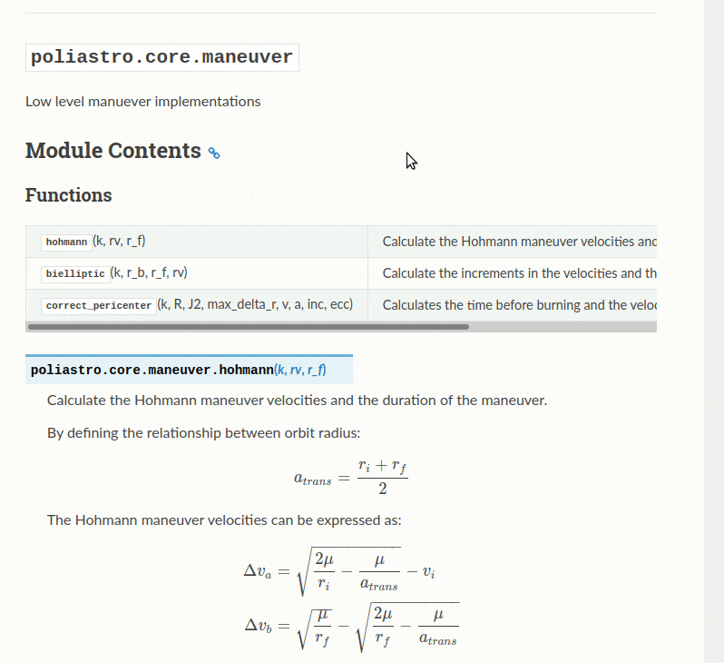
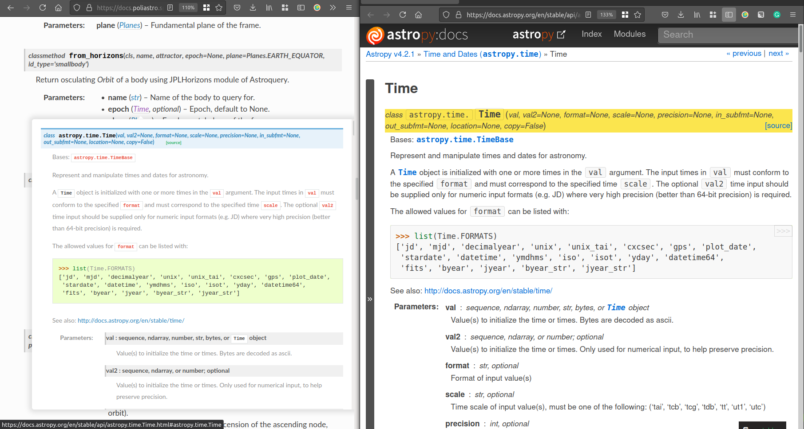

.. post:: June 10, 2021
   :tags: czi, grant, czi-grant, embed, sphinx-hoverxref
   :author: Juan Luis
   :location: MAD

.. meta::
   :description lang=en:
      New release of sphinx-hoverxref, our Sphinx extension to add tooltips to cross references,
      with support for intersphinx.

New release of sphinx-hoverxref with support for intersphinx
============================================================

We have released version 0.6b1 of `sphinx-hoverxref`_,
a Sphinx extension that shows a *content preview*
of a cross-reference.

This extension is an essential part
of the work we are doing to improve interoperability of documentation in general,
and scientific documentation in particular,
thanks to the `CZI grant </czi-grant-announcement>`_ we received last year.

   sphinx-hoverxref displaying a tooltip including an equation

.. _sphinx-hoverxref: https://sphinx-hoverxref.readthedocs.io/

Embedding content previews
--------------------------

Technical documentation is full of cross-references (or *xrefs*):
hyperlinks to related parts of the documentation (or even to an external project)
that help contextualize the information.
`Sphinx provides powerful tools for creating
xrefs <https://docs.readthedocs.io/en/stable/guides/cross-referencing-with-sphinx.html>`_,
which can be used to link other parts of the documentation,
and in the case of software projects, also to specific objects of the API.

However, jumping through several links while reading some documentation
can be distracting, since opening them might need either a context switch
or keeping a new browser tab for a later moment.

Here is where `sphinx-hoverxref`_ comes to the rescue:
it scans the cross-references and attaches content previews to them
(either *tooltips* or *modal* dialogues)
that embed the contents of the page the xrefs point to.
This way, when the user is interested in a particular topic,
they can hover the mouse over the link
and display the content preview
instead of opening the link.

Moreover, the content previews created by `sphinx-hoverxref`_
also work if the embedded content requires a particular extension to be rendered.
This makes it possible to embed content that includes mathematical equations, for example.

Support for ``intersphinx``
---------------------------

Version 0.6b1 of `sphinx-hoverxref`_ introduces opt-in support for Intersphinx linking.
`sphinx.ext.intersphinx <https://www.sphinx-doc.org/en/master/usage/extensions/intersphinx.html>`_
is a Sphinx extension
that generates automatic links to the documentation of objects in other projects,
and now it's possible to show floating windows on them too.

         using sphinx-hoverxref
   :target: /_images/sphinx-hoverxref-intersphinx.png

   A project (left) embedding content from another project linked through intersphinx (right)
   using sphinx-hoverxref

To enable it, the user needs to specify
which projects from the `intersphinx_mapping <https://www.sphinx-doc.org/en/master/usage/extensions/intersphinx.html#confval-intersphinx_mapping>`_
will be scanned by ``sphinx-hoverxref``, using a new configuration value:

.. code-block:: python

   # Values of the intersphinx_mapping keys that you want to enable hoverxref on
   hoverxref_intersphinx = [
      "astropy",
      "numpy",
      "scipy",
      "matplotlib",
   ]

Moreover, the look & feel of the current project is preserved
even if the target documentation has a different theme or colors,
which makes the result more visually consistent.

.. note::

   At the moment, the target project needs to be hosted on Read the Docs,
   which is a limitation that we hope to remove in the future.

You can draw inspiration from some community projects that are using this feature already:

- `The Grill`_, an extension for digital content creation with Maya, Houdini, and other 3D modeling applications,
  and references another project called `naming <https://naming.readthedocs.io/>`_.
- `poliastro`_, a Python library for interactive Astrodynamics
  that makes cross-references to `Astropy <https://docs.astropy.org/>`_ and other projects.

We are excited to see what our users can do with `sphinx-hoverxref`_,
and will continue working on it in the future.

Considering using Read the Docs for your next Sphinx or MkDocs project?
Check out `our documentation <https://docs.readthedocs.io/>`_ to get started!

.. _The Grill: https://grill.readthedocs.io/
.. _poliastro: https://docs.poliastro.space/
