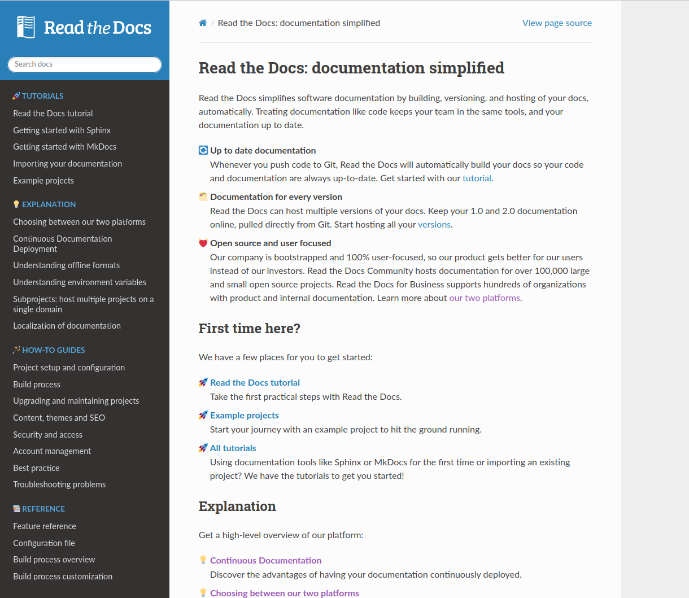
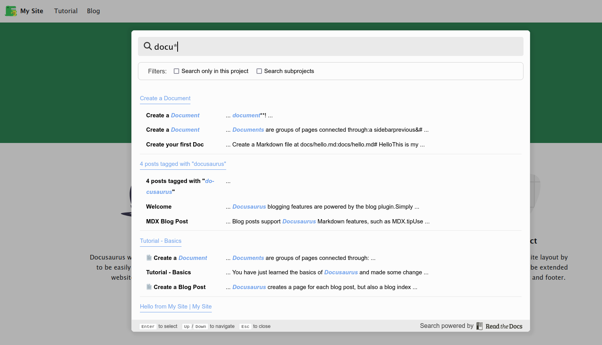

.. post:: March 30, 2023
   :tags: newsletter, python
   :author: Ben
   :location: MLM
   :category: Newsletter

.. meta::
   :description lang=en:
      Company updates and new features from the last month,
      current focus, and upcoming features.

Read the Docs newsletter - April 2023
=====================================

News and updates
----------------

- 📚️ Over the past 6 months, we gradually refactored our user documentation to align with the `Diátaxis Framework <https://diataxis.fr>`__. The results have now crystialized in the structure of the navigation sidebar and the landing page on `docs.readthedocs.io <https://docs.readthedocs.io/en/stable/>`__.
- 🌄️ The first proof-of-concept for a new API and JavaScript library has been test-driven. It is capable of displaying a menu matching our current :doc:`flyout menu <readthedocs:flyout-menu>` visible in the below screenshot.
  The big difference will be that the new API and library will be useful for any documentation framework or static site generator to allow for full control of the new flyout menu and access to API data.
- 📊️ All of our websites now use `Plausible <https://plausible.io/>`__ for analytics.
- ⚙️ Added a new build variable ``READTHEDOCS_CANONICAL_URL`` that's useful for projects that want to be aware of the canonical base URL while building.
  `View docs <https://docs.readthedocs.io/en/stable/reference/environment-variables.html#envvar-READTHEDOCS_CANONICAL_URL>`__.
- ⚙️ Added new build variables ``READTHEDOCS_GIT_CLONE_URL``, ``READTHEDOCS_GIT_IDENTIFIER``, and ``READTHEDOCS_GIT_COMMIT_HASH`` for projects that need to access Git data while building.
  `View docs <https://docs.readthedocs.io/en/stable/reference/environment-variables.html#envvar- READTHEDOCS_GIT_CLONE_URL>`__.
- 🔒️ Fixed vulnerability: `Cache poisoning: serving arbitrary content on documentation sites  <https://github.com/readthedocs/readthedocs.org/security/advisories/GHSA-mp38-vprc-7hf5>`__

You can always see the latest changes to our platforms in our :doc:`Read the Docs Changelog <readthedocs:changelog>`.

   
   A screenshot of how our user documentation looks in April 2023.

Upcoming features
-----------------

- 📚️ We are still doing changes in our documentation structure and content.
- ⚡️ *A lot of work* is happening these days on big front-end features.
  In :doc:`the last newsletter </newsletter-march-2023>`, we mentioned the new Dashboard and :doc:`the migration to about.readthedocs.com </website-migration>`.
  What's new is that we've also started building a generic JavaScript client accompanied with APIs that will give additional features to *any* documentation project or static site built and served on the Read the Docs platform.

   
   Our proof-of-concept for the JavaScript client is going well! In the screenshot, you can see how the generic Read the Docs search indexing works and how a generic search dialog gives the documentation project additional super powers ⚡️

Want to follow along with our development progress? `View our full Roadmap 📍️`_

.. _View our full Roadmap 📍️: https://github.com/orgs/readthedocs/projects/156/views/1

.. Possible issues
.. ---------------

.. - TBD

Awesome project of the month
----------------------------

`Crate.io <https://crate.io/docs/crate/tutorials/en/latest//>`__ has integrated 15 Sphinx projects in the same website experience and written their own theme.
So they rightly deserve to be this month's addition to `Awesome Read the Docs Projects 🕶️ <https://github.com/readthedocs-examples/awesome-read-the-docs>`_.
See the highlights in the following
`Twitter thread <https://twitter.com/readthedocs/status/1643210113186951168>`__ or
`Mastodon thread <https://fosstodon.org/@readthedocs/110140385774009615>`_:

.. raw:: html

   <blockquote class="twitter-tweet">
A recent addition to our list of awesome projects 🕶️: <a href="https://twitter.com/crateio?ref_src=twsrc%5Etfw">@crateio</a> <a href="https://twitter.com/crateio?ref_src=twsrc%5Etfw">@crateio</a> combines multiple documentation projects into the same website experience.  Oh, by the way, the <a href="https://twitter.com/crateio?ref_src=twsrc%5Etfw">@crateio</a> docs will turn 10 years old in July 🎂️<a href="https://t.co/4cQMj3SNx6">https://t.co/4cQMj3SNx6</a>  Here is a 🤏 (small) 🧵 <a href="https://t.co/tqP1dH5czb">pic.twitter.com/tqP1dH5czb</a>
&mdash; Read the Docs (@readthedocs) <a href="https://twitter.com/readthedocs/status/1643210113186951168?ref_src=twsrc%5Etfw">April 4, 2023</a></blockquote> 

.. Tip of the month
.. ----------------

.. TBD

-------

Questions? Comments? Ideas for the next newsletter? `Contact us`_!

.. Keeping this here for now, in case we need to link to ourselves :)

.. _Contact us: mailto:hello@readthedocs.org
