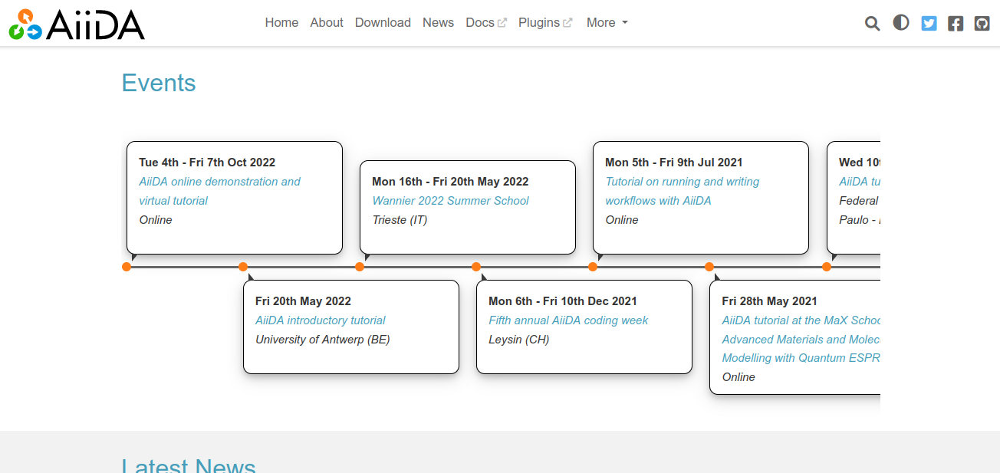

.. post:: Dec 6, 2022
   :tags: newsletter, python
   :author: Ben
   :location: MLM

.. meta::
   :description lang=en:
      Company updates and new features from the last month,
      current focus, and upcoming features.

Read the Docs newsletter - December 2022
========================================

Here are the first features and updates that have hatched since we announced a Q4 focus on core platform features in the :doc:`previous newsletter </newsletter-december-2022>`.

News and updates
----------------

The latest updates from our team:

- ⚙️ The *entire* build process can now be overridden (if you need it). :doc:`See the Announcement </build-customization>`.

  - 💡️ This is useful if you want to publish outputs generated from a framework that isn't supported by default. We wrote some examples for :ref:`Pelican <readthedocs:build-customization:Pelican>` and :ref:`Docsify <readthedocs:build-customization:Docsify>`.
  - 💡️ You can also *extend* the build process for instance you can :ref:`skip a build <readthedocs:build-customization:Cancel build based on a condition>`.

- 🐘️ We started *tooting* in the Fediverse (Mastodon). Follow us at `@readthedocs@fosstodon.org <https://fosstodon.org/@readthedocs>`_
- 🛳️ :doc:`Server-Side Search API v3 <readthedocs:server-side-search/index>` has been released.
- 🎬️ We are preparing to redirect our existing front pages to our new marketing site: `about.readthedocs.com <https://about.readthedocs.com/>`_. `Let us know <mailto:hello@readthedocs.org>`_ know if you have comments or ideas for it.
- ⏳️ We organized a large refactor of our user documentation to comply with the `Diátaxis methodology framework <https://diataxis.fr>`_.
  So far, we broke it down into `73 tasks and counting <https://github.com/readthedocs/readthedocs.org/issues?q=is%3Aissue++diataxis+iteration+>`_.
- ✅️ We added a :doc:`readthedocs:unofficial-projects` that will help official maintainers to de-list forks among others.
- ✅️ We added `an additional auditing feature <https://github.com/readthedocs/readthedocs.org/pull/9607>`_,
  whereby invitations are added to the Security Log.
  The feature is available for users of Read the Docs for Business.
- ✅️ We found, fixed and disclosed a security issue,
  `XSS: Allow serving of arbitrary HTML files from main domain <https://github.com/readthedocs/readthedocs.org/security/advisories/GHSA-98pf-gfh3-x3mp>`_.

You can always see the latest changes to our platforms in our :doc:`Read the Docs Changelog <readthedocs:changelog>`.

Upcoming features
-----------------

- We're working on improving our integration with `Material for MkDocs <https://squidfunk.github.io/mkdocs-material/>`_, which is a great theme for `MkDocs <https://www.mkdocs.org/>`_ documentation projects.
- Many improvements to our URL handling code, which will allow us to support more flexible URL configurations for projects.
- A search redesign to make it nicer across our dashboard and in-doc search experiences. 
- 404 pages are being improved by contextualization the user message, giving relevant guidance to readers and project owners.

Possible issues
---------------

If you find regressions in any new releases of the `sphinx-rtd-theme <https://sphinx-rtd-theme.readthedocs.io/>`_,
please don't hesitate to `open an issue on GitHub <https://github.com/readthedocs/sphinx_rtd_theme/>`_.

We continue planning to be more active in deprecating old and outdated approaches to using our platform in Q4.
We don't have anything firm to announce here yet,
but we do plan to be more active in removing these features in the coming months.

.. _december2022_tip_of_the_month:

Tip of the month
----------------

Do you need to document past or upcoming events? `Chris Sewell <https://github.com/chrisjsewell>`_ has created `sphinx-timeline <https://sphinx-timeline.readthedocs.io/en/latest/>`_ for exactly this.

See sphinx-timeline in full action on the `main page of AiiDA <https://www.aiida.net/>`_ (which by the way is built with Read the Docs).

Awesome Project of the month
----------------------------

`Nautobot <https://docs.nautobot.com/>`_ is a great example of a documentation landing page with several subprojects. See all the highlights in the following `Twitter thread <https://twitter.com/readthedocs/status/1595010133796462593>`_:

.. raw:: html

   <blockquote class="twitter-tweet">
Nautobot is the project of our today’s 💫 Showcase the Docs 🌟 edition!  “An extensible and flexible Network Source of Truth and Network Automation Platform that is the cornerstone of any network automation architecture” <a href="https://twitter.com/hashtag/Nautobot?src=hash&amp;ref_src=twsrc%5Etfw">#Nautobot</a> <a href="https://twitter.com/hashtag/documentation?src=hash&amp;ref_src=twsrc%5Etfw">#documentation</a> <a href="https://t.co/icp2q2Epty">pic.twitter.com/icp2q2Epty</a>
&mdash; Read the Docs (@readthedocs) <a href="https://twitter.com/readthedocs/status/1595010133796462593?ref_src=twsrc%5Etfw">November 22, 2022</a></blockquote> 

Awesome Read the Docs Projects List 🕶️
--------------------------------------

Looking for more inspiration? Check out our new list: `Awesome Read the Docs Projects <https://github.com/readthedocs-examples/awesome-read-the-docs>`_.

----

Considering using Read the Docs for your next documentation project?
Check out `our documentation <https://docs.readthedocs.io/>`_ to get started!

Questions? Comments? Ideas for the next newsletter? `Contact us`_!

.. Keeping this here for now, in case we need to link to ourselves :)

.. _Contact us: mailto:hello@readthedocs.org
