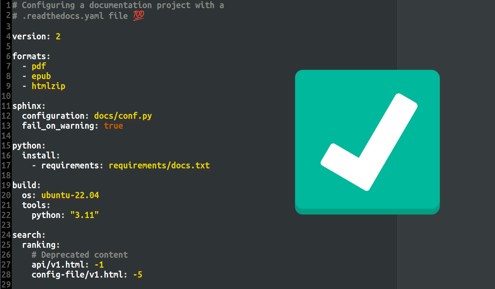

.. post:: June 5, 2023
   :tags: newsletter, python
   :author: Ben
   :location: MLM
   :category: Newsletter

Read the Docs newsletter - June 2023
====================================

News and updates
----------------

- ⚠️ A ``.readthedocs.yaml`` configuration file will be required for your future builds.
  Read more about this change in :doc:`/migrate-configuration-v2`.
- ✅️ Visiting a language slug of a project without specifying the version now redirects to the default version.
  For instance, ``/en/`` redirects to ``/en/latest/``.
- 🍿️ All the talks from `Write the Docs Portland 2023 <https://www.writethedocs.org/conf/portland/2023/>`__, which we sponsored this year, are ready to watch:
  `Open the new playlist on Youtube <https://www.youtube.com/watch?v=EZJ0mk9Jj3s&list=PLZAeFn6dfHpneQPsDWa4OmEpgW4pNiaZ2>`__.
- 🐛️ Builds with multiline ``build.commands`` should now be `working reliably <https://github.com/readthedocs/readthedocs.org/issues/10103>`_.
  Thanks to everyone who helped out!
- 🐛️ `sphinx-rtd-theme 1.2.1 <https://sphinx-rtd-theme.readthedocs.io/en/stable/changelog.html>`__ has been released with an important bug fix that caused jQuery to not load in certain projects.
- 🔒️ We updated custom domain certificates to 1.2 as the *minimum* TLS version.
- 🔒️ A high-severity vulnerability has been fixed:
  `Write access to projects via API V2 (/api/v2/project/* endpoints) for any logged-in user <https://github.com/readthedocs/readthedocs.org/security/advisories/GHSA-rqfv-8rrx-prmh>`__.

Possible issues
---------------

- ⚠️ Please make sure to read the blog post: :doc:`/migrate-configuration-v2`.

  If you didn't have a ``.readthedocs.yaml`` configuration file,
  and you are introducing one for the first time,
  we're excited for you to be able to use all our new features like specifying build tool versions (Node, Rust, etc.)!
  
  The blog post offers help with that 💡️

Awesome project of the month
----------------------------

The most recent addition to
`Awesome Read the Docs Projects 🕶️ <https://github.com/readthedocs-examples/awesome-read-the-docs>`__
is `Ray's documentation <https://docs.ray.io/>`__ 🕶️.

Ray is an open source project, consisting of several components that all have their own section in a combined documentation set.

See the highlights in the following
`Twitter thread <https://twitter.com/readthedocs/status/1663923671470047234>`__ or
`Mastodon thread <https://fosstodon.org/@readthedocs/110463989114312961>`__:

.. raw:: html

   <blockquote class="twitter-tweet">
The most recent addition to our awesome projects list is Ray&#39;s documentation 🕶️.  Ray by <a href="https://twitter.com/anyscalecompute?ref_src=twsrc%5Etfw">@anyscalecompute</a> is an open source project, consisting of several components that all have their own section in a combined documentation set.<a href="https://t.co/9YGpJvYpFD">https://t.co/9YGpJvYpFD</a>  Here is a 🤏 (small) 🧵 <a href="https://t.co/QElmmJetPB">pic.twitter.com/QElmmJetPB</a>
&mdash; Read the Docs (@readthedocs) <a href="https://twitter.com/readthedocs/status/1663923671470047234?ref_src=twsrc%5Etfw">May 31, 2023</a></blockquote>  

   
   It was always better to use a ``.readthedocs.yaml`` file.
   It gives so many more options and makes it possible to version your configuration in your Git repository ⚡️

-------

Questions? Comments? Ideas for the next newsletter? `Contact us`_!

.. Keeping this here for now, in case we need to link to ourselves :)

.. _Contact us: mailto:hello@readthedocs.org
.. _reach out: https://readthedocs.org/support/

