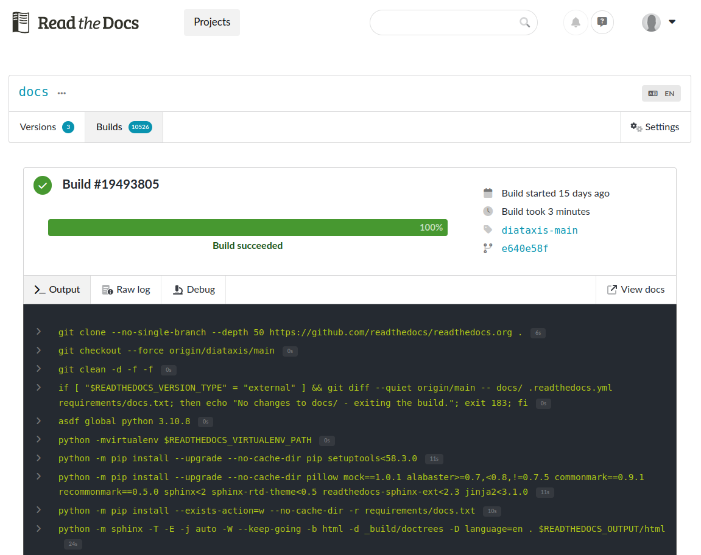

.. post:: March 1, 2023
   :tags: newsletter, python
   :author: Ben
   :location: MLM

.. meta::
   :description lang=en:
      Company updates and new features from the last month,
      current focus, and upcoming features.

Read the Docs newsletter - March 2023
=====================================

News and updates
----------------

Here are the latest updates from our team since the :doc:`previous newsletter </newsletter-february-2023>`:

- ⭐️ We passed our 10,000th issue/pull request on GitHub. And it's pretty much an equal split between the `5039 issues <https://github.com/readthedocs/readthedocs.org/issues>`__ and `4872 pull requests <https://github.com/readthedocs/readthedocs.org/pulls>`__ now registered.
  Thanks to the whole community for building this together through code, issues, suggestions... and documentation!
- 🌪️ Follow up: Build times have gone rapidly down after last month's introduction of parallel uploading of artifacts with `rclone`_.
  Depending on the number of files in your build output,
  build times may have gone down several seconds or several minutes.
  For instance, a large project like `Write the Docs <https://readthedocs.org/projects/writethedocs-www/builds/>`__ has gone down from ~7 minutes to under 3 minutes.
  If you want to see the change for your project,
  have a look at your build times before and after **February 8**.
- 1️⃣️ We are going to have 1 primary marketing website in the future,
  while still running two different product for our Community & Business users.
  The first change that is now done is redirecting logged out users on `https://readthedocs.com/` to `about.readthedocs.com <https://about.readthedocs.com>`__.
  We will soon be doing this for logged out users going to `https://readthedocs.org/`,
  excepting project-specific subpages.
- 🧹️ We are now able to delist unofficial projects from search engines.
  If you find an unofficial and unmaintained project,
  :doc:`please see our policy on unofficial and unmaintained projects <readthedocs:unofficial-projects>`.
- 🐞 Custom 404s with Sphinx DirHTML builder `are now supported <https://github.com/readthedocs/sphinx-notfound-page/issues/215>`__.
- 🐞 :doc:`Pull Request <readthedocs:guides/pull-requests>` builds should point to previews, not build pages. The fix will be deployed on March 7.
- 🔒️ Vulnerability fixed: Pull requests preview builds `GHSA-h4cf-8gv8-4chf <https://github.com/readthedocs/readthedocs.org/security/advisories/GHSA-h4cf-8gv8-4chf>`__
- 🔒️ Vulnerability fixed: Access to files from any project possible with crafted path traversal, see: `GHSA-5w8m-r7jm-mhp9 <https://github.com/readthedocs/readthedocs.org/security/advisories/GHSA-5w8m-r7jm-mhp9>`__.

You can always see the latest changes to our platforms in our :doc:`Read the Docs Changelog <readthedocs:changelog>`.

.. _rclone: https://rclone.org/

Upcoming features
-----------------

- 🪄️ The Django application that handles uncached requests on all our hosted documentation is called El Proxito.
  And that application is getting a major refactor,
  improving both speed and features.
  Most of the refactoring work is already merged and within the coming weeks,
  we will start to enable it gradually while monitoring if there are issues.
- 📚️ Documentation refactor underway:
  A regular reader of our :doc:`user docs <readthedocs:index>` might notice that our navigation has been greatly changed and now contains only the `4 Diátaxis categories <https://diataxis.fr/>`__.
  The first work from our Diátaxis documentation refactor is now live and the general work has moved into shorter iterations.
  Once we have gathered all the final experience from the refactor,
  we will announce it together with practical inputs for how other documentation projects might approach such a refactor.
- 💬️ ...If you are planning your own refactor of an existing documentation project,
  we'd love to hear what your questions and concerns are and address those future blog posts and talks.
- 🎬️ We're slowly moving towards a public beta of our v2 dashboard experience. Here's a screenshot of what's to come...

Want to follow along with our development progress? `View our full Roadmap 📍️`_

.. _View our full Roadmap 📍️: https://github.com/orgs/readthedocs/projects/156/views/1

Possible issues
---------------

- TBD

Awesome Project of the month
----------------------------

`The Haskell Tool Stack <https://docs.haskellstack.org/>`__ is commonly known in the world of `Haskell <https://en.wikipedia.org/wiki/Haskell>`__ as simply Stack and is this month's chosen entry from `Awesome Read the Docs Projects 🕶️ <https://github.com/readthedocs-examples/awesome-read-the-docs>`_.
See our chosen highlights from Stack's documentation in the following `Twitter thread <https://twitter.com/readthedocs/status/1603095976117522433>`_:

.. raw:: html

   <blockquote class="twitter-tweet">
GeoPandas is an open source project to make working with <a href="https://twitter.com/hashtag/geospatial?src=hash&amp;ref_src=twsrc%5Etfw">#geospatial</a> data in <a href="https://twitter.com/hashtag/Python?src=hash&amp;ref_src=twsrc%5Etfw">#Python</a> easier. <a href="https://twitter.com/geopandas?ref_src=twsrc%5Etfw">@GeoPandas</a> extends the datatypes used by pandas to allow spatial operations on geometric types.  We want to highlight some things we love from their docs.  🤏 (small) 🧵 <a href="https://t.co/Hj82s6SDQP">pic.twitter.com/Hj82s6SDQP</a>
&mdash; Read the Docs (@readthedocs) <a href="https://twitter.com/readthedocs/status/1603095976117522433?ref_src=twsrc%5Etfw">December 14, 2022</a></blockquote> 

Tip of the month
----------------

When you post links to your documentation on chat and social media,
you will probably see a generic preview.
Enter `sphinxext-opengraph <https://github.com/wpilibsuite/sphinxext-opengraph>`__!

The extension allows you to configure your own preview card,
compatible with all major chat and social media platforms.
The feature which we really enjoy is that it will detect and use the first illustration used in your documentation.
If you want to see it in action,
try sharing a link to this newsletter blog post (marketing unintended).

-------

Questions? Comments? Ideas for the next newsletter? `Contact us`_!

.. Keeping this here for now, in case we need to link to ourselves :)

.. _Contact us: mailto:hello@readthedocs.org
