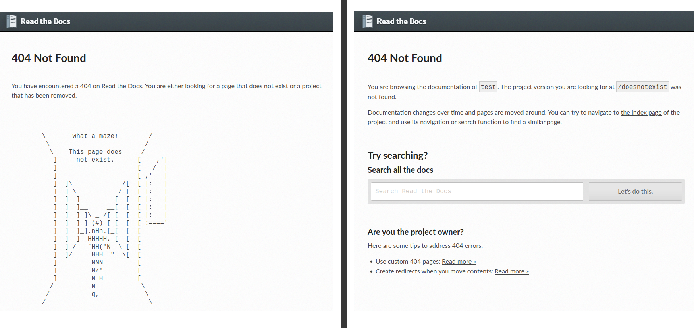

.. post:: May 11, 2023
   :tags: newsletter, python
   :author: Ben
   :location: MLM
   :category: Newsletter

Read the Docs newsletter - May 2023
===================================

News and updates
----------------

- 🚁️ The proxy application El Proxito has been rewritten and the new version is rolled out to selected projects.
  El Proxito resolves URLs for all documentation websites hosted on Read the Docs.
  The new rewrite improves the performance of the resolver and makes it possible to add planned features.
  We are enabling the new implementation gradually for more projects,
  while monitoring its stability.
  Eventually, it will be enabled on all projects.
- 🔎️ ...One of the new features available in the new El Proxito implementation,
  is an improved 404 page (see the screenshot below).
  The new 404 pages contain better error messages and tips for users and project owners.
- 💫️ We now support multiple ``.readthedocs.yaml`` files in the same repository.
  This is especially useful for *monorepos* containing multiple documentation projects with different configurations.
  This allows for instance configurations of several projects with different documentation tools and build environments.
  Read more about the feature :doc:`in our docs <readthedocs:guides/setup/monorepo>`.
- ⚙️ If you use ``build.commands`` in ``.readthedocs.yaml``,
  you are no longer required to have a ``build.tools`` section.
  We changed the validation for ``.readthedocs.yaml`` to accommodate projects that do not need any of the built-in tools exposed.
- 🐛️ Fixed: URLs on pull request builds were pointing to the build page,
  rather than the documentation preview.
  If a build is successful,
  the URL now points to the documentation preview.
- 🐛️ Fixed: `An issue <https://github.com/readthedocs/readthedocs.org/issues/10290#issuecomment-1542841524>`__ in our legacy build images caused builds using Sphinx to start failing on May 4th when urllib3 2.0.2 was released.
  The issue has been fixed by upgrading OpenSSL on these images.

  We still encourage to specify a newer build image,
  an example is given `in this comment <https://github.com/readthedocs/readthedocs.org/issues/10290#issuecomment-1535120995>`__.
- 🔒️ Vulnerability fixed: `CAS session hijacking on Read the Docs for Business <https://github.com/readthedocs/readthedocs.org/security/advisories/GHSA-4mgr-vrh5-hj8q>`__

   
   Left: the classic old 404 page with the ascii art maze - right: new contextualized 404 pages.
   The new default 404 pages are aimed at being more helpful to users and project owners and uses context to specify what was not found, such as a file path, a version, a translation or the project slug.

Upcoming features
-----------------

- 🚁️ As mentioned earlier,
  we have rewritten our proxy application El Proxito and will start to add new features.
  One of the features being worked on is the ability to serve :doc:`subprojects <readthedocs:subprojects>` at custom URL paths.

Want to follow along with our development progress? `View our full Roadmap 📍️`_

.. _View our full Roadmap 📍️: https://github.com/orgs/readthedocs/projects/156/views/1

Possible issues
---------------

We have updated our legacy build images with a newer version of OpenSSL.
If this update affects your builds, please `reach out`_.

These changes only affects projects that do not specify :ref:`build.os <readthedocs:config-file/v2:build.os>`.
We will announce plans to sunset the legacy build images soon.
For instance, urllib3 will also announce further removal of OpenSSL support,
and we already consider the old build images as pretty *legacy*.

.. Awesome project of the month
.. ----------------------------

.. Skipped

.. Tip of the month
.. ----------------

.. Skipped

-------

Questions? Comments? Ideas for the next newsletter? `Contact us`_!

.. Keeping this here for now, in case we need to link to ourselves :)

.. _Contact us: mailto:hello@readthedocs.org
.. _reach out: https://readthedocs.org/support/

