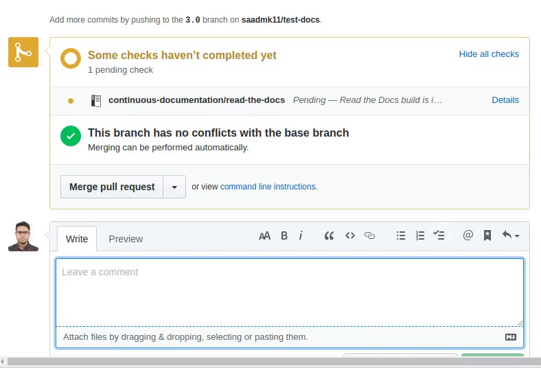

.. post:: Jan 27, 2021
   :tags: pr-builder, continuous-documentation, feature
   :author: Eric
   :location: BND

Pull Request Builders available for all users
=============================================

We're excited to announce that `Pull Request building <https://docs.readthedocs.io/en/latest/guides/autobuild-docs-for-pull-requests.html>`_ is now available for all Read the Docs users.
We have been working on this feature for over a year,
and having it available for all our users is a major milestone.

This feature allows users to confirm documentation builds correctly for all of their commits,
not just ones merged into branches that are activated on Read the Docs.
This moves documentation into your continuous integration pipeline,
and improves the workflow for everyone working on documentation.

    GitHub Build Status Reporting for Pull Requests

You can read more about this new feature in our :doc:`previous blog post announcing it </building-docs-for-pull-requests>` and in our `documentation for the feature <https://docs.readthedocs.io/page/guides/autobuild-docs-for-pull-requests.html>`_.

Serving docs for every branch
-----------------------------

Along with building and validating each branch on your repository,
**we also host a rendered version of the documentation.**
This allows you to see exactly how the docs will look when they are deployed.

Building the documentation on Read the Docs during the development process also helps test integration with Read the Docs.
The entire build process is run for each commit,
so this will ensure that builds work as expected when you're ready to merge into production.

These previews will stay live for 90 days from the time you merge or close the Pull Request,
allowing you to finish any outstanding work on the task.

Limitations
-----------

Due to the increased demand for build resources,
the Pull Request builders have the following limitations:

* Read the Docs search is not enabled on these versions
* Only HTML versions of the documentation are built (not PDF, ePub, etc.)
* Documentation builds are concurrency limited. Read the Docs for Business concurrency varies based on your plan, and Read the Docs Community are limited to 2 concurrent builds.

We are working to address these limitations over time,
but given the increase in scale with these builds it will take some time.

Give us feedback
----------------

We always love to hear from our users about the product.
If you have feedback on this feature of any others,
you can always reach us at hello@readthedocs.org.
