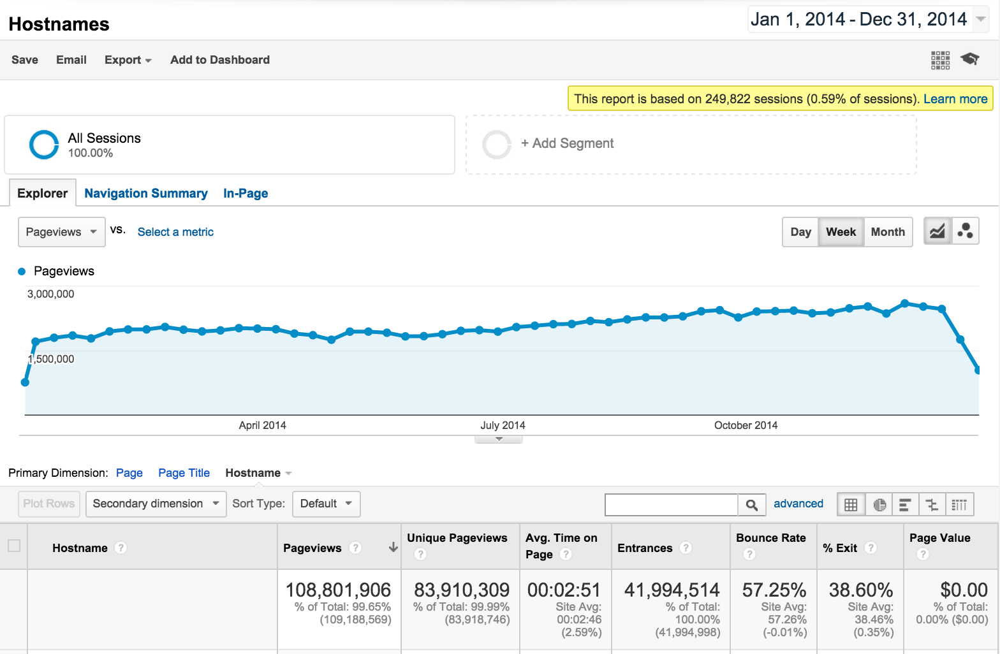

.. post:: Dec 31, 2014
   :tags: stats, year-in-review

Read the Docs 2014 Stats
========================

2014 has been another banner year for Read the Docs.
The project has been steadily growing in the open source ecosystem,
expanding a good deal outside of the Python community.
We have built a bunch of fantastic new features,
and continued improving the documentation experience for the open source world.

.. note:: 

	You can always see our latest 30 days stats at http://www.seethestats.com/site/readthedocs.org. 

	Our post from 2013 is also available here: https://blog.readthedocs.com/read-the-docs-2013-stats/

Community
---------

This year, we had:

* `46 people`_ who committed code (+17% from last year)
* 1253 commits (+127%)
* `500 issues`_ - 376 closed, 130 open (+84%)

We have over doubled the commit count from the previous year,
along with having almost double the issues.
Our contributor base has grown slowly,
but not nearly at the rate of issues and user growth.

A big part of that is the addition of `Anthony <http://ohess.org>`_ to the core team. He has been a great help, and done lots of good work on the project.

Page Views
----------

Our stats:

* 110 Million Page Views (+70%)
* 24 Million Unique Visitors (+85%)

Page view growth has been steady again this year.
It's great to see so many people reading documentation that we are hosting.

With an average time of 3 minutes per page,
this means users have spent **nearly 600 years** [#]_ reading documentation on Read the Docs this year.
I can only imagine how much development time has been saved.

.. note:: I believe this makes Read the Docs the biggest documentation hosting website in the world. Pretty neat.

A picture shows more than the words do, I think. Here is our weekly graph for the year:

Site Stats
----------

The stats, in total numbers:

* 15128 projects (+90%)
* 22263 users (+90%)
* 2053616 builds (+97%)

Read the Docs has some high profile projects that push a lot of traffic.
There are however thousands of smaller libraries and projects that fill out that full range of documentation that we host.

Funding
-------

Our hosting costs are sponsored by `Rackspace`_,
which is fantastically generous of them.

Development on Read the Docs is funded by the community `on Gittip`_.
I am very grateful for the support that the community has given the project over the years.
We haven't been promoting the sponsorship on Gittip,
so the numbers there have gone down.

We are looking at more funding options in the new year,
more on that soon :)

The stats:

* $100/wk (-40%)
* 100 people giving money (-12%)

Conclusion
----------

2014 has been an amazing year for Read the Docs.
We have continued growing and serving more traffic.

We are working on a number of new features to expand the user base,
and make the site more approachable.
We look forward to continuing to improve the documentation ecosystem in the new year.

.. _Read the Docs: https://readthedocs.org/
.. _46 people: https://github.com/rtfd/readthedocs.org/graphs/contributors?from=2014-01-01&to=2014-12-31&type=c
.. _500 issues: https://github.com/rtfd/readthedocs.org/search?utf8=%E2%9C%93&q=created%3A%3E%3D2014-01-01&type=Issues
.. _on Gittip: https://www.gittip.com/readthedocs/
.. _Rackspace: http://rackspace.com/

.. [#] 2min 51sec * 108,801,906 views / 525,600 minutes/year = 589.6 years
