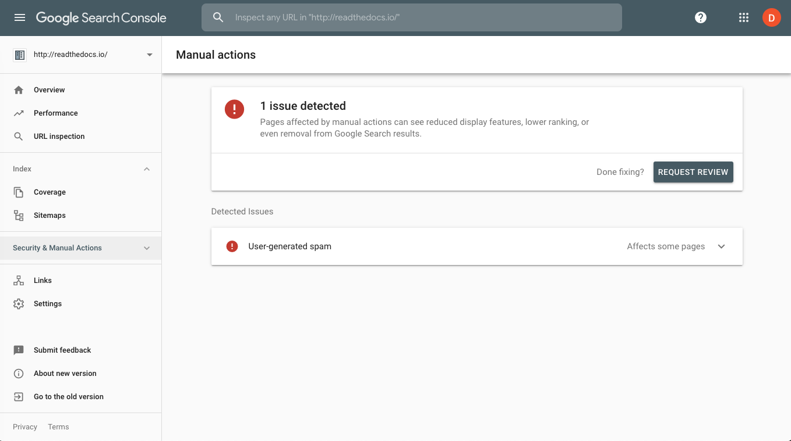

.. post:: August 29, 2019
   :tags: sphinx, seo
   :author: David
   :location: SAN

.. meta::
   :description lang=en:
       Learn SEO tricks and tips specific to the Sphinx documentation system
       and Read the Docs to rank higher on search engines and help users
       find the right content in your docs.

Optimizing Sphinx Documentation for Search Engines
==================================================

Recently, we published a guide on `SEO for technical docs`_
with the goal of helping documentation authors and project maintainers create docs
so that end users can find what they're looking for easier.

.. _SEO for technical docs: https://docs.readthedocs.io/en/latest/guides/technical-docs-seo-guide.html

One developer asked me point blank after I mentioned our new guide,
"Hasn't Google closed most of the loopholes that sites use to rank better?".
I've heard this opinion from a few technologists before so I wasn't too surprised.
Moz.com, an authority on search engine optimization,
makes a distinction between what they call `black hat SEO and white hat SEO`_
to differentiate between these "loopholes" and more useful site improvements that help SEO.

Black hat SEO is basically a set of tactics some sites use to improve rankings
without actually making their site better to end visitors.
This includes techniques like displaying different content to search engines (cloaking),
link farming, or adding semi-relevant keywords into a page (keyword stuffing).
When Google and Bing discover a site doing this,
they take action and lower a site's ranking until the problems are fixed.
Black hat SEO is inherently risky and we try to stay away from this kind of SEO.

Instead our guide focuses on white hat SEO which aims to improve your docs' search engine rankings
by helping search engine's understand and index your docs better and present it better to searchers.
This kind of SEO isn't trying to cheat search engine rankings and it's a win for everyone.
Searchers find the content they're looking for more easily
while search engines understand the content better and can show more relevant results.

Specifically, we also tried to focus on SEO for documentation
and how Sphinx and Read the Docs make it easier including:

* Making your docs display better on search engine results
* Helping search engines understand and index your docs better
* Improving your ranking based on user and search engine feedback

.. _black hat SEO and white hat SEO: https://moz.com/blog/black-hat-or-white-hat-seo-ask-better-questions

Making your docs display better in search results
-------------------------------------------------

.. figure:: _static/google-search-engine-results.png
    :align: center
    :figwidth: 100%
    :target: _static/google-search-engine-results.png

    Google search engine results with the page title, URL, and a description.

Displaying more relevant information in search results will cause more people to click through to your docs.
Again, your goal is not to use cheap tactics to rank better and trick users into clicking.
Rather, you are trying to legitimately improve your content such that users
better understand what to expect on a page before they click.

Some of the most important aspects of improved search listings are:

* Use descriptive and accurate titles in the HTML ``<title>`` tag.
  With Sphinx, the ``<title>`` comes from the top heading on the page.
* Ensure your URLs are descriptive. They are displayed in search results.
  For Sphinx, the URL uses the source file's filename.
* Make sure the words your readers would search for to find your site
  are actually included on your pages.
  Ideally, these key words should be in your ``<title>`` or description.

These concepts are not only important in helping guide users to click on your documentation,
most of the same optimizations are useful to the search engine when indexing your site
and when ranking your site for searchers.

Helping search engines understand your docs
-------------------------------------------

Search engines like Google and Bing crawl through the internet
following links and redirects in an attempt to understand and build an index
of what various pages and sites are about.

These tips and features can help you control how search engines index your docs:

* Make sure your entire site can be navigated by following links.
  If you have "orphan" pages, a search engine won't find them.
  Using Sphinx's "toctree" directive helps make sure all your pages are indexed and navigable.
* Redirects and canonical URLs are useful when the same content exists in multiple places
  or moves from one page to another.
  Read the Docs dashboard lets authors setup redirects from one page to another
  or from one version of the documentation to another.
* Using a ``robots.txt`` and ``sitemap.xml`` file can help you control how search engines crawl your docs.
  For example, you could tell search engines to ignore unsupported versions of your documentation.
  Read the Docs provides both a ``robots.txt`` and a sitemap and has ways for you to override them.

Improving your SEO ranking from feedback
----------------------------------------

Search engines provide tools to help webmasters build their site better
and to give insights and feedback about the indexing of sites by the search engine spiders.
`Google Search Console <https://search.google.com/search-console>`_ and
`Bing Webmaster Tools <https://www.bing.com/webmaster/help/webmaster-guidelines-30fba23a>`_
are tools for webmasters
to get feedback about the crawling of their sites (or docs in our case).
These tools can show technical issues with indexing like pages that are failing for some reason
and also possible security or spam issues on your site that can lower your ranking.

    Google search console showing an issue with user generated spam, a constant battle at Read the Docs.

Feedback on keywords users use to find your docs is also really helpful.
This is true both for the phrases people searched for on a search engine
and for the search terms people queried in Sphinx and Read the Docs' built-in search features.
Analytics tools like Google Analytics can provide these insights,
but as part of our :doc:`search improvements and search analytics </improved-search-and-search-as-you-type>`,
Read the Docs is going to show project maintainers the most common search queries to help them improve as well.

SEO is no substitute for good writing
-------------------------------------

One area we didn't detail in our guide is how more general improvements to technical writing
can also improve your search engine rankings. This could be a whole post by itself.

Using simpler words, for example, has a number of advantages in technical writing.
The excellent Microsoft Style Guide `recommends using simple words and concise sentences`_
and Apple's Style Guide `echoes the same sentiment`_.
Simpler sentences are easier to understand for both people
as well as machines like search engines and automatic translators.

While any style guide you read will tell you to avoid using jargon,
technical writing and software docs have a certain amount of unavoidable technical terminology.
Defining these terms and phrases when you first use them helps users as well as search engines.

.. _recommends using simple words and concise sentences: https://docs.microsoft.com/en-us/style-guide/word-choice/use-simple-words-concise-sentences
.. _echoes the same sentiment: https://help.apple.com/applestyleguide/#/apsg1ff68ab5

In summary
----------

Always keep in mind that your ultimate goal is to make your docs more discoverable by people, not machines.
While the concepts and tactics here will help you rank better with search engines,
providing high quality documentation and making it easier to find and understand
is the best way to make sure people actually read the docs.
