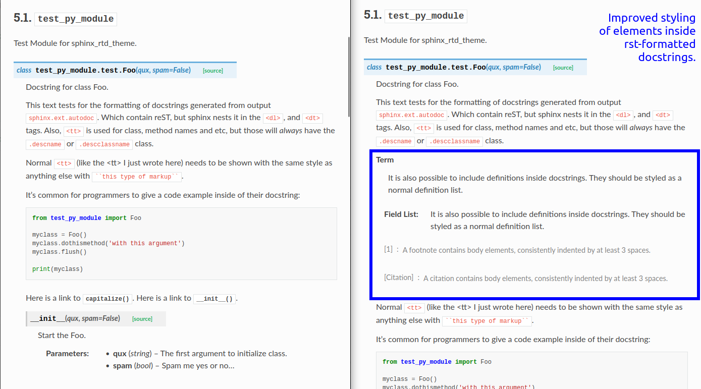

.. post:: October 14, 2022
    :tags: theme, release
    :author: Benjamin
    :location: Malmö, Sweden

.. meta::
    :description lang=en:
        Information on sphinx-rtd-theme version 1.1.0

Announcing sphinx_rtd_theme 1.1.0
===================

We are happy to announce the release of new version of our theme, `sphinx-rtd-theme`_. In this release, we have focused on bug fixes, backwards compatibility, and making the way for future releases.

.. _sphinx-rtd-theme: https://sphinx-rtd-theme.readthedocs.io/en/stable/

Changes and new features 💄
---------------------------

Visually, we have a couple of small tweaks that most people won't notice unless we mention them here 😇 The general strategy of the theme is to avoid breaking stuff, and that also goes for the visual parts.

* The ``<kbd>`` tag now has a nicer styling.
* Breadcrumb styling has been updated
* Table cells with multiple paragraphs now have a correct formatting.
* Definition lists rendered correctly in API docs
* Issues with citation rendering and styling fixed
* Long URLs break into several lines instead of overflowing

.. image:: img/sphinx-rtd-theme-110-screenshot1.png
   :width: 30%
   :target: _images/sphinx-rtd-theme-110-screenshot1.png

In the engine-room, we have ensured the long-term stability for users of the theme by putting upper bounds on ``Sphinx<6`` and ``docutils<0.18``. In the case of Sphinx, we know that the upcoming 6.x series (probably due later this year) will be incompatible with sphinx-rtd-theme 1.1 (we are working on fixes) and as for docutils 0.18, we already have the fixes lined up for version 1.2, but we need to drop compatibility with older Sphinx releases to include these.

We also fixed an issue that caused the theme to fail when Sphinx ``5.2.0.post0`` was released and will ensure that this doesn't happen again.

`Read the full changelog <changelog>`_

.. _changelog: https://github.com/readthedocs/sphinx_rtd_theme/blob/master/docs/changelog.rst

How to upgrade
--------------

If you are using the theme for the first time, please refer the general `installation instructions <install>`_.

For projects hosted on Read the Docs, the general update instruction is to modify your project's ``requirements.txt`` where you should add ``sphinx-rtd-theme==1.1.0`` (or replace any existing entries).

If your project doesn't have a Python requirements file ``requirements.txt``, you need to add one in order to use newer versions of sphinx-rtd-theme. Read the Docs doesn't automatically update Python packages such as ``Sphinx`` or ``sphinx-rtd-theme`` because this risks breaking existing projects. You can read more about adding a ``requirements.txt`` in our :doc:`Documentation about Reproducible Builds <readthedocs:guides/reproducible-builds>`.

.. _install: https://sphinx-rtd-theme.readthedocs.io/en/stable/installing.html

Upcoming releases
-----------------

Each little change comes with an overhead of testing, perfection and a long list of legacy support. We are addressing all that in upcoming releases, so it will become less cumbersome to add new features. The building and testing processes are refined and future releases will drop some of the legacy.

Here are the highlights from our roadmap:

* sphinx-rtd-theme 1.2: Adds docutils 0.18 support, possibly also docutils 0.19
* sphinx-rtd-theme 2.0: Adds Sphinx 6.x support, dropping legacy support for several Sphinx releases and old browsers.

If you wish to see more details, `view the full roadmap <roadmap>`_.

.. _roadmap: https://sphinx-rtd-theme.readthedocs.io/en/stable/development.html#roadmap 
